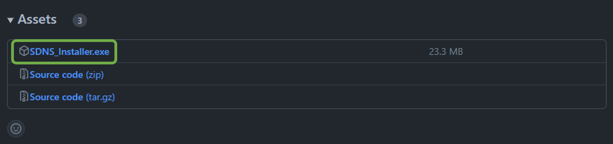
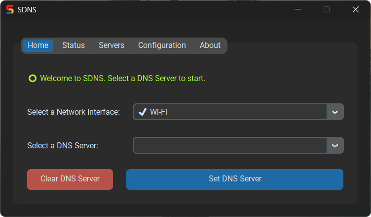
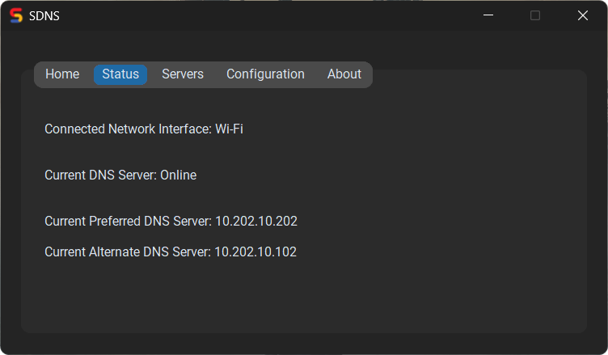
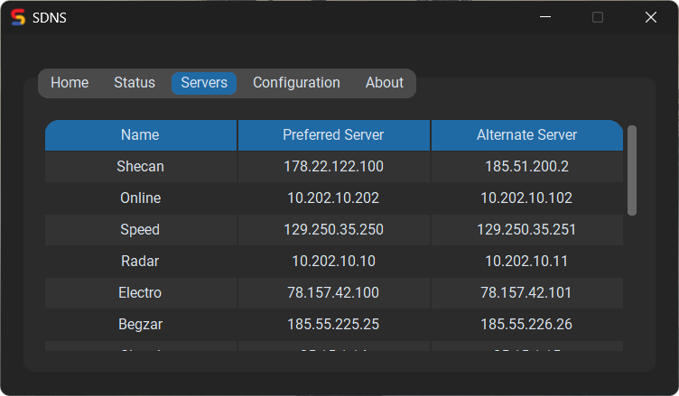
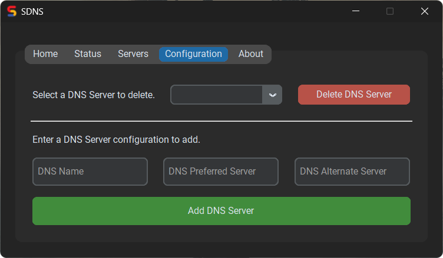
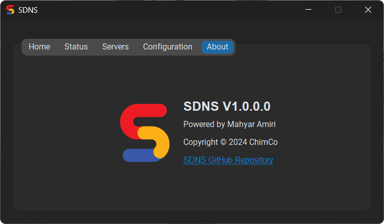

#  SDNS

> Don't forget to leave a Star ⭐

An IPv4 DNS Server Changer

<!-- TOC -->
* [Download](#download)
* [Installation](#installation)
* [Usage](#usage)
  * [Home](#home)
    * [Connect to a DNS Server](#connect-to-a-dns-server)
    * [Clear the DNS Server](#clear-the-dns-server)
  * [Status](#status)
  * [Servers](#servers)
  * [Configuration](#configuration)
    * [Delete an existing DNS Server](#delete-an-existing-dns-server)
    * [Add a new DNS Server](#add-a-new-dns-server)
  * [About](#about)
<!-- TOC -->

## Download

1. Go to this [link 📥](https://github.com/mahyar-amiri/SDNS/releases).
2. Go to `Assets` section in the latest version.
3. Click on `SDNS_Installer.exe` to download the installer file.

## Installation

1. Open `SDNS_Installer.exe` as an administrator.
2. Click on `Install` to start the installation progress.
3. Click on `Finish` to close the installation window.

## Usage

### Home

#### Connect to a DNS Server

1. Select a Network Interface. (The connected networks are shown with ✔️)
2. Select a DNS Server.
3. Click on `Set DNS Server` to set the selected DNS server to the selected network.

#### Clear the DNS Server

1. Select a Network Interface. (The connected networks are shown with ✔️)
2. Click on `Clear DNS Server` to clear the DNS server from the selected network.

### Status

You can see the `Connected Network Interface` and `Current DNS Server` information in this section.

### Servers

You can see the list of DNS Servers in this section.

### Configuration

#### Delete an existing DNS Server

1. Select a DNS Server.
2. Click on `Delete DNS Server` to Delete the selected DNS server from the database.

#### Add a new DNS Server

1. Enter a `Name`, `Preferred Server` and `Alternate Server` for the new DNS Server.
2. Click on `Add DNS Server` to Add the new DNS server to the database.

### About

You can see the application's information and its version in this section.
